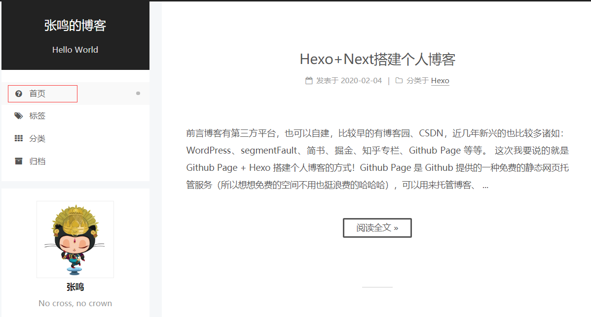
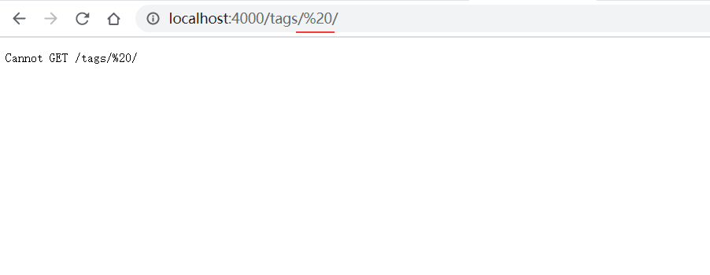

## 1. 前言

博客有第三方平台，也可以自建，比较早的有博客园、CSDN，近几年新兴的也比较多诸如：WordPress、segmentFault、简书、掘金、知乎专栏、Github Page 等等。

这次我要说的就是 Github Page + Hexo 搭建个人博客的方式！Github Page 是 Github 提供的一种免费的静态网页托管服务（所以想想免费的空间不用也挺浪费的哈哈哈），可以用来托管博客、项目官网等静态网页。支持 Jekyll、Hugo、Hexo 编译静态资源，这次我们的主角就是 Hexo 了，具体的内容下面在文章内介绍。

## 2. 安装

所有必备的应用程序安装完成后，即可使用 npm 安装 Hexo。

```
$ npm install -g hexo-cli
```

安装 Hexo 完成后，请执行下列命令，Hexo 将会在指定文件夹中新建所需要的文件。

```
$ hexo init <folder>
$ cd <folder>
$ npm install
```

新建完成后，指定文件夹的目录如下：

```
.├── _config.yml
 ├── package.json
 ├── scaffolds
 ├── source
 |   ├── _drafts
 |   └── _posts
 └── themes
```

**_config.yml**

网站的 [配置](https://hexo.io/zh-cn/docs/configuration) 信息，您可以在此配置大部分的参数。

**package.json**

应用程序的信息。[EJS](https://ejs.co/), [Stylus](http://learnboost.github.io/stylus/) 和 [Markdown](http://daringfireball.net/projects/markdown/) renderer 已默认安装，您可以自由移除。

```json
package.json
{
  "name": "hexo-site",
  "version": "0.0.0",
  "private": true,
  "hexo": {
    "version": ""
  },
  "dependencies": {
    "hexo": "^3.8.0",
    "hexo-generator-archive": "^0.1.5",
    "hexo-generator-category": "^0.1.3",
    "hexo-generator-index": "^0.2.1",
    "hexo-generator-tag": "^0.2.0",
    "hexo-renderer-ejs": "^0.3.1",
    "hexo-renderer-stylus": "^0.3.3",
    "hexo-renderer-marked": "^0.3.2",
    "hexo-server": "^0.3.3"
  }
}
```

**scaffolds**

[模版](https://hexo.io/zh-cn/docs/writing) 文件夹。当您新建文章时，Hexo 会根据 scaffold 来建立文件。

Hexo的模板是指在新建的文章文件中默认填充的内容。例如，如果您修改scaffold/post.md中的Front-matter内容，那么每次新建一篇文章时都会包含这个修改。

**source**

资源文件夹是存放用户资源的地方。除 `_posts` 文件夹之外，开头命名为 `_` (下划线)的文件 / 文件夹和隐藏的文件将会被忽略。Markdown 和 HTML 文件会被解析并放到 `public` 文件夹，而其他文件会被拷贝过去。

**themes**

[主题](https://hexo.io/zh-cn/docs/themes) 文件夹。Hexo 会根据主题来生成静态页面。

## 3. Hexo的Next主题详细配置

经过一番不懈的努力，我们终于按照[Hexo免费搭建一个属于自己的博客](https://www.jianshu.com/p/51617690f8ca)搭建好了一个属于自己的博客，并且还安装了一个Next主题，但是我们的博客一开始还是很简陋的，我们需要把她装修一下。

> - 在 Hexo 中有两份主要的配置文件，其名称都是 _config.yml。 其中，一份位于站点根目录下，主要包含 Hexo 本身的配置；另一份位于主题目录下，这份配置由主题作者提供，主要用于配置主题相关的选项。
>    为了描述方便，在以下说明中，将前者称为***站点配置文件***， 后者称为***主题配置文件***。
> - 以下所有终端执行的命令都在你的Hexo根目录下

#### 1、基本信息配置

> 基本信息包括：博客标题、作者、描述、语言等等。

打开 ***站点配置文件*** ，找到Site模块

```undefined
title: 标题
subtitle: 副标题
description: 描述
author: 作者
language: 语言（简体中文是zh-Hans）
timezone: 网站时区（Hexo 默认使用您电脑的时区，不用写）
```

关于 ***站点配置文件*** 中的其他配置可参考[站点配置

#### 2、菜单设置

> 菜单包括：首页、归档、分类、标签、关于等等

我们刚开始默认的菜单只有首页和归档两个，不能够满足我们的要求，所以需要添加菜单，打开 ***主题配置文件*** 找到`Menu Settings`

```cpp
menu:
  home: / || home                          //首页
  archives: /archives/ || archive          //归档
  categories: /categories/ || th           //分类
  tags: /tags/ || tags                     //标签
  about: /about/ || user                   //关于
  #schedule: /schedule/ || calendar        //日程表
  #sitemap: /sitemap.xml || sitemap        //站点地图
  #commonweal: /404/ || heartbeat          //公益404
```

看看你需要哪个菜单就把哪个取消注释打开就行了；
 关于后面的格式，以`archives: /archives/ || archive`为例：
 `||` 之前的`/archives/`表示标题“归档”，关于标题的格式可以去`themes/next/languages/zh-Hans.yml`中参考或修改
 `||`之后的`archive`表示图标，可以去[Font Awesome](https://links.jianshu.com/go?to=http%3A%2F%2Ffontawesome.io%2Ficons%2F)中查看或修改，Next主题所有的图标都来自Font Awesome。

**踩坑说明，修改主题配置后主题图标不生效，具体情况如图所示**



**原因：**小编当时也在网上搜了很多帖子，每一个修改步骤都是按照帖子里面来的，先修改**主题**配置文件中的*menu*配置，然后再修改*menu_icons*的配置，但是无论怎么改都是不生效；后来小编发现，在最新版的next主题中，菜单图标设置已经不是通过*menu_icons*属性设置了，这个属性只用于设置是否显示图标，新版主题设置直接就在*menu*属性中，例如：

```
home: / || home
```

其实，在clone主题之后初始化的文件中就是这样写的，只怪小编没有仔细看就安装旧版的教程改了~

但是，按照新版设置改过来之后，又出现了新的问题，图标的样式虽然显示出来了，但是点击图标跳转到的网址却是错误的，如下图所示，跳转的网址莫名其妙多加了%20，导致网址错误加载不出页面~



这个问题小编尝试了很久，才发现是配置图标的时候，**||符号前面多了一个空格**导致的，删掉多余的空格就OK啦~~

#### 3、Next主题样式设置

我们百里挑一选择了Next主题，不过Next主题还有4种风格供我们选择，打开 ***主题配置文件*** 找到`Scheme Settings`

```bash
# Schemes
# scheme: Muse
# scheme: Mist
scheme: Pisces
# scheme: Gemini
```

4种风格大同小异，本人用的是Pisces风格，你们可以选择自己喜欢的风格。

#### 4、侧栏设置

> 侧栏设置包括：侧栏位置、侧栏显示与否、文章间距、返回顶部按钮等等

打开 ***主题配置文件*** 找到`sidebar`字段

```cpp
sidebar:
# Sidebar Position - 侧栏位置（只对Pisces | Gemini两种风格有效）
  position: left        //靠左放置
  #position: right      //靠右放置

# Sidebar Display - 侧栏显示时机（只对Muse | Mist两种风格有效）
  #display: post        //默认行为，在文章页面（拥有目录列表）时显示
  display: always       //在所有页面中都显示
  #display: hide        //在所有页面中都隐藏（可以手动展开）
  #display: remove      //完全移除

  offset: 12            //文章间距（只对Pisces | Gemini两种风格有效）

  b2t: false            //返回顶部按钮（只对Pisces | Gemini两种风格有效）

  scrollpercent: true   //返回顶部按钮的百分比
```

#### 5、头像设置

打开 ***主题配置文件*** 找到`Sidebar Avatar`字段

```bash
# Sidebar Avatar
avatar: /images/header.jpg
```

这是头像的路径，只需把你的头像命名为`header.jpg`（随便命名）放入`themes/next/source/images`中，将`avatar`的路径名改成你的头像名就OK啦！

#### 6、添加分类模块

1、新建一个分类页面

```cpp
$ hexo new page categories
```

2、你会发现你的`source`文件夹下有了`categorcies/index.md`，打开`index.md`文件将title设置为`title: 分类`
3、打开 ***主题配置文件*** 找到`menu`，将categorcies取消注释
4、把文章归入分类只需在文章的顶部标题下方添加`categories`字段，即可自动创建分类名并加入对应的分类中
举个栗子：

```undefined
title: 分类测试文章标题
categories: 分类名
```

#### 7、添加标签模块

1、新建一个标签页面

```cpp
$ hexo new page tags
```

2、你会发现你的`source`文件夹下有了`tags/index.md`，打开`index.md`文件将title设置为`title: 标签`
3、打开 ***主题配置文件*** 找到`menu`，将tags取消注释
4、把文章添加标签只需在文章的顶部标题下方添加`tags`字段，即可自动创建标签名并归入对应的标签中
举个栗子：

```undefined
title: 标签测试文章标题
tags: 
  - 标签1
  - 标签2
  ...
```

#### 8、添加关于模块

1、新建一个关于页面

```cpp
$ hexo new page about
```

2、你会发现你的`source`文件夹下有了`about/index.md`，打开`index.md`文件即可编辑关于你的信息，可以随编辑。
3、打开 ***主题配置文件*** 找到`menu`，将about取消注释

#### 9、添加搜索功能

1、安装 hexo-generator-searchdb插件

```ruby
$ npm install hexo-generator-searchdb --save
```

2、打开 ***站点配置文件*** 找到`Extensions`在下面添加

```xml
# 搜索
search:
  path: search.xml
  field: post
  format: html
  limit: 10000
```

3、打开 ***主题配置文件*** 找到`Local search`，将`enable`设置为`true`

#### 10、添加阅读全文按钮

NexT主题下的首页默认是显示每一篇文章的全文的，如果文章很长就要往下拉很远才能看到下一篇文章

我们要设置成每一篇文章只显示150个字的摘要，然后底部显示一个阅读原文的按钮，点击可以进入阅读全文

1、打开NexT主题的配置文件，站点根目录\themes\next\_config.yml
2、搜索auto_excerpt，然后配置如下，开启摘要，设置摘要长度为150个字

```
# Automatically Excerpt (Not recommend).
# Use <!-- more --> in the post to control excerpt accurately.
auto_excerpt:
  enable: true
  length: 150
```

#### 11、去掉文章目录标题的自动编号

我们自己写文章的时候一般都会自己带上标题编号，但是默认的主题会给我们带上编号，很是别扭，如何去掉呢？
打开***主题配置文件***，找到

``` xml
# Table Of Contents in the Sidebar
toc:
  enable: true

  # Automatically add list number to toc.
  number: false

  # If true, all words will placed on next lines if header width longer then sidebar width.
  wrap: false
```

将`number`改为`false`即可

#### 12、添加本地图片

1、 把***主页配置文件***`_config.yml` 里的`post_asset_folder:`这个选项设置为`true`

2、 在你的hexo目录下执行这样一句话`npm install hexo-asset-image --save`，这是下载安装一个可以上传本地图片的插件，来自大佬：大佬的git](https://github.com/CodeFalling/hexo-asset-image)

3、 等待一小段时间后，再运行`hexo n "xxxx"`来生成md博文时，`/source/_posts`文件夹内除了`xxxx.md`文件还有一个同名的文件夹

4、 最后在`xxxx.md`中想引入图片时，先把图片复制到xxxx这个文件夹中，然后只需要在xxxx.md中按照markdown的格式引入图片：

```

```

**注意： xxxx是这个md文件的名字，也是同名文件夹的名字。只需要有文件夹名字即可，不需要有什么绝对路径。你想引入的图片就只需要放入xxxx这个文件夹内就好了，很像引用相对路径。**

5、 最后检查一下，`hexo g`生成页面后，进入`public\2017\02\26\index.html`文件中查看相关字段，可以发现，html标签内的语句是``，而不是`。这很重要，关乎你的网页是否可以真正加载你想插入的图片。

**踩坑说明，部署上去图片不显示，查看图片路径为/.com//...**

**原因是：**使用 npm install [https://github.com/CodeFalling/hexo-asset-image](https://links.jianshu.com/go?to=https%3A%2F%2Fgithub.com%2FCodeFalling%2Fhexo-asset-image) --save 安装0.0.5版本的hexo-asset-image插件。 使用 npm install hexo-asset-image --save 安装的是1.0.0版本的hexo-asset-image插件。 两者最直接的区别是映射关系不同。也就是因为插件版本更新了，之前的使用方法有所变化，于是我安装了0.0.5版本的插件，就成功加载图片了

#### 13、修改文章内链接文本样式

打开文件 `themes/next/source/css/_common/components/post/post.styl`，在末尾添加

```css
.post-body p a {
  color: #0593d3;
  border-bottom: none;
  border-bottom: 1px solid #0593d3;
  &:hover {
    color: #fc6423;
    border-bottom: none;
    border-bottom: 1px solid #fc6423;
  }
}
```

其中选择 .post-body 是为了不影响标题，选择 p 是为了不影响首页“阅读全文”的显示样式,颜色可以自己定义。

#### 14、添加字数统计和阅读时长

首先安装一个插件

```
$ npm install hexo-symbols-count-time --save
```

接着博客根目录下的配置文件里添加以下配置

```
# 文章字数统计
symbols_count_time:
  symbols: true
  time: true
  total_symbols: true
  total_time: true
```

最后到 next 主题的配置文件下开启 symbols_count_time 字段

```
# Post wordcount display settings
# Dependencies: https://github.com/theme-next/hexo-symbols-count-time
symbols_count_time:
  separated_meta: true
  item_text_post: true
  item_text_total: false
  awl: 4
  wpm: 275
```

